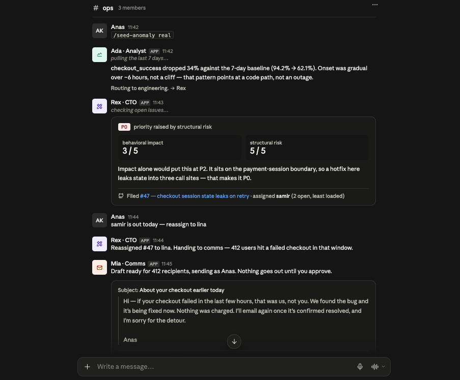

# Bridge

App Name: **Standup**
Three agents with different tool scopes coordinate an incident response inside the Slack channel a founding team already watches.

Built for **Agents, Everywhere** — AI Tinkerers global hackathon, 12–13 September 2026.



*One thread, end to end: the analyst characterises a 34% checkout drop and routes it to engineering, the CTO scores behavioral impact against structural risk and files issue #47, the founder reassigns mid-chain because an engineer is out, and the customer email stops at a draft until someone clicks Approve.*

---

## The problem

 A metric drops, and the founder tells every engineer to stop and look at it. Or the founder wants a feature, and it jumps the queue because the founder asked. Both calls are made on behavior alone — what users will notice — with no weight on the architecture the change touches, and no look at what each engineer is already on or when it's due.

Prioritising is a calculation, not a reflex: how urgent is this, does it cross a structural boundary, and does it outrank what each engineer is currently doing? If it does, the engineer whose current work loses least takes it. If it doesn't, it goes on the board at the right rank and nobody is interrupted. That calculation belongs before the ticket is written, not after the team has stopped.

## What it does

One workflow, end to end.

1. A deterministic SQL check flags an anomaly in the metrics store.
2. **Analyst** reads the metrics, characterises the drop, and decides where it goes — engineering, customer comms, or nowhere.
3. **CTO** pulls open GitHub issues to see who is least loaded, scores behavioral impact and structural risk separately, states which one drove the priority, and files a real issue.
4. **Comms** drafts a customer email in the founder's voice and posts it for approval.
5. A human clicks **Approve**, and only then does it send.

Every step posts into a single Slack thread under its own bot identity. The founder reads the reasoning as it happens and can reply into the thread mid-chain.

## Why this belongs in Slack

The value isn't that an agent is reachable in Slack. It's that the negotiation between agents becomes a shared artifact a team can watch and interrupt.

A private session with one assistant has nowhere for a second person to see a decision being made, and nowhere to step in before the irreversible step. Moving the same three agents behind an API and rendering their results in a dashboard would delete the entire point.

## Separation of authority

The three agents are not a stylistic choice. Each holds a different tool set, and the boundary is enforced by what it can call.

| Agent | Slack identity | Tools | Can write to |
|---|---|---|---|
| Analyst | `Ada · Analyst` | `query_metrics` | nothing — read-only |
| CTO | `Rex · CTO` | `list_open_issues`, `score_priority`, `create_issue` | GitHub |
| Comms | `Mia · Comms` | `draft_email` | nothing — drafts only |

The analyst cannot open issues. The CTO cannot draft customer mail. A single agent holding all five tools could email customers on a bad generation about a metrics query; this one structurally cannot.

**Sending is not an agent capability at all.** `draft_email` returns a draft and stops. The Slack button handler sends. The only irreversible, customer-facing action in the system is unreachable from the model, not merely discouraged by a prompt.

## Routing is a decision

The analyst's handoff is a real branch, not a hardcoded sequence:

- system fault → CTO
- pure customer-communication issue → Comms
- ordinary variance → stop, with a one-line explanation

Seeded fixtures cover both branches. An 8% dip in signups stops at the analyst. A 34% drop in checkout success runs the full chain.

## Priority scoring

Most incident tooling ranks by user impact alone. That's the failure mode this agent is built against — leadership optimises for observable behavior and systematically discounts architectural cost.

The CTO agent scores two axes and says which one won:

- **behavioral impact** — how many users, how badly
- **structural risk** — whether the fix touches an architectural boundary or is a local patch

`structural_risk >= 4` floors the priority at P0 regardless of impact. A moderate-impact bug sitting on the payment-session boundary outranks a high-impact cosmetic one, and the agent states the architectural reason in one sentence on the issue.

## Human in the loop

The draft is posted to the thread with **Approve** and **Cancel** buttons. The agent says so itself: nothing goes out until you approve. One human touch per run, on the one action that reaches a customer.

## On-demand access

`/cto <question>` starts a run at the CTO agent — same agent, same tools, same boundary. The command changes where the run begins, not what the agent is allowed to do.

## Architecture

Five files. Dependencies point one direction.

```
main.py         Entry point: `from src.app import main`
src/app.py      Slack: handlers, RunHooks, buttons, poller   → imports agents
src/agents.py   Three Agents + handoffs + prompts            → imports tools
src/tools.py    Five tool functions                          → imports db, integrations
src/db.py       Postgres reads, deterministic anomaly check
seed.py         Schema + fixture data
```

`agents.py` and `tools.py` never import Slack. Status lines come from a `RunHooks` implementation in `app.py` that posts on agent start, tool start, and agent end. That is the only place the two worlds touch, and it's what keeps the agents portable to any other surface.

One abstraction earns its place: a `MetricsSource` protocol with `PostgresMetricsSource` behind it. Everything else is a concrete module-level function. No repository pattern, no service layer, no DI, no base classes.

### Schema

```sql
create schema product;   -- metrics. The startup's data. The analyst reads it.
create schema ops;       -- anomalies + processed_at. The system's own state.
```

The read/write boundary shows up in the data layer, not only in tool assignment.

There is no agent-state table, no run log, no approval audit. **The Slack thread is the audit trail** — building a second one would contradict the premise. The only persisted state the system needs is `processed_at`, which makes the poller idempotent.

## Failure handling

- **Idempotency** — the poller claims an anomaly and stamps `processed_at` before running. A chain never fires twice for the same row.
- **Visible retry** — if the GitHub write fails, the CTO agent says so in the thread and retries, rather than dying silently mid-chain.

## Stack

| Piece | Role |
|---|---|
| Slack Bolt, Socket Mode | The environment. No tunnel, no public URL, no inbound HTTP. |
| OpenAI Agents SDK | Three `Agent` objects, `handoff()` routing, lifecycle hooks. No supervisor. |
| OpenAI API | Small fast model for the analyst, larger for the CTO's priority reasoning. |
| Postgres (Neon) | Metrics and anomalies. |
| GitHub REST | Real issue creation, real workload data. |
| Brevo | The single outbound email, behind the button. |

Three bot identities come from one Slack app via the `chat:write.customize` scope — each agent posts with its own `username` and `icon_emoji`.

No web framework. Socket Mode means Slack dials out to the process, so there are no routes to serve.

## What's real and what's seeded

Stated plainly, because it changes how the demo should be read.

**Real** — the GitHub issue is created through the API and exists at a URL you can open. The repository has genuine open issues across two assignees, which is what `list_open_issues` reads to determine workload. The email sends through Brevo and arrives. Slack transport, threading, buttons, and identities are all real. Routing and priority reasoning are live model decisions.

**Seeded** — the metrics table is Postgres with fixture data we inserted, not live product analytics. It sits behind the `MetricsSource` protocol; a `PostHogMetricsSource` drops in without touching a single agent or tool.

## Scope decisions

Deliberately not built, so that one workflow is complete rather than five half-finished.

| Cut | Why |
|---|---|
| Code auditing | Unbounded scope, nothing demonstrable in two minutes |
| Asana / Jira integration | New auth surface, no marginal capability |
| Scheduled daily reports | Invisible in a recorded demo; the chain is the report |
| Refund, dispute, support-policy flows | A second workflow. Depth on one beats breadth across two. |
| User surveys | A product feature, not an agent behaviour |
| Live PostHog | The adapter seam is in place; wiring it adds no visible capability |
| Web dashboard | Slack is the interface. A dashboard would contradict the thesis. |
| Multi-tenancy, auth, deployment | Not scored, not visible |

### Sponsor tooling

Used where load-bearing, skipped where it would be decoration.

- **OpenAI Agents SDK** — used. `handoff()` is the routing primitive; without it this is a hand-rolled state machine.
- **CopilotKit Channels** — evaluated and skipped. The managed Slack path does not deliver slash commands, and its model is inbound-triggered, which cannot express a chain the system starts on its own.
- **Auth0 for AI Agents** — the right long-term answer for the tool boundary. Scope is currently enforced in-process at agent construction; per-agent credentials would move it to the token layer. Next step, not a hackathon step.
- **Exa** — no fit. Every data source here is first-party. Adding web search would be a call with nothing to look up.
- **Trigger.dev** — durable execution would improve the poller, but agent latency is already handled by posting status lines into the thread, which solves the same perceived problem where the user is looking.

## Running it

```bash
pip install -r requirements.txt
cp .env.example .env    # or .env.local — Slack bot + app tokens, OpenAI, GitHub PAT, Brevo, DATABASE_URL
python seed.py
python main.py
```

In Slack: `/seed-anomaly real` and watch `#ops`.

Slack scopes: `chat:write`, `chat:write.customize`, `app_mentions:read`, `commands`. Socket Mode enabled.

## Demo

<!-- video link -->

## Built during the event

All application code written during the hackathon window. Reused: Slack Bolt, OpenAI Agents SDK, PyGithub, psycopg — libraries only, no starter template.
